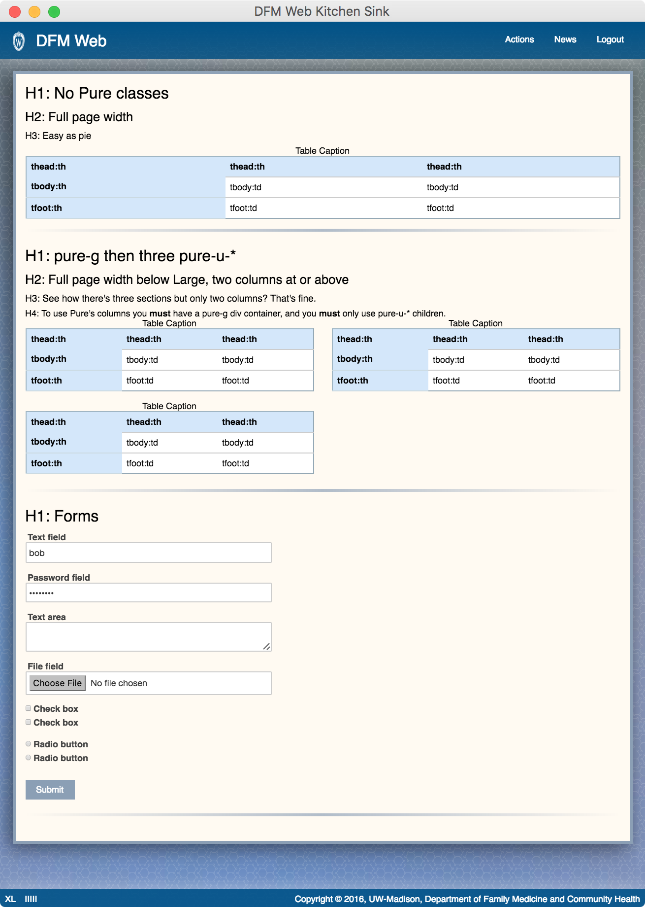
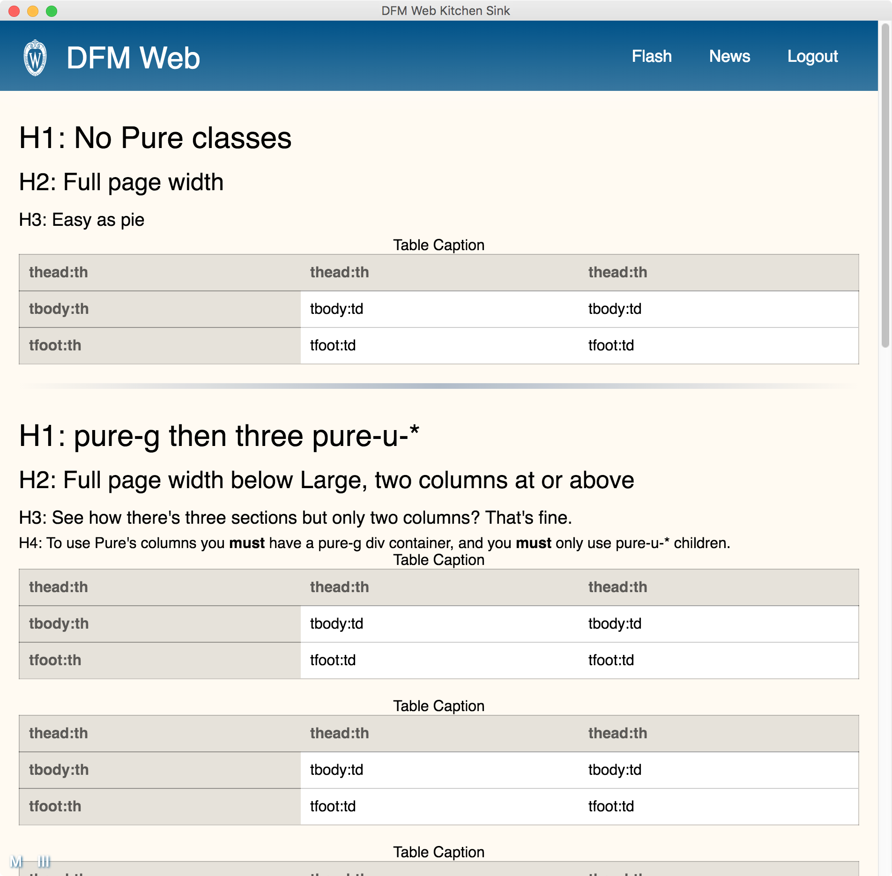
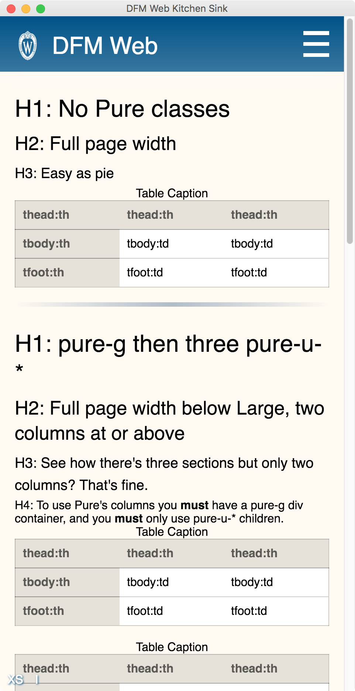

# DfmWeb

[](https://github.com/DFMCH/dfm_web/actions/workflows/test.yml)

## Requirements

- Rails 8+ and Ruby 3.2+; Rails 8.0 and 8.1 are the initial CI targets.
- Propshaft or Sprockets, supplied by the host application.
- Current browsers. Internet Explorer is no longer supported.

## Install

Gemfile
```ruby
gem 'dfm_web'
```

Terminal:
```bash
bundle install
```

application.html.erb
```erb
  <body>
    <%= render 'layouts/nav' %>
    <%= render 'layouts/flash' %>
    <%= render 'layouts/main' %>
    <%= render 'layouts/footer' %>
  </body>
```

## Rails 8 Automatic Asset Inclusion

DfmWeb 8 automatically adds its readable CSS and vanilla JavaScript to successful,
buffered HTML documents with an HTML doctype and explicit `html`/`head` elements.
It supports both Propshaft and Sprockets. No activation call, import map, or
consumer build tool is needed. Layout partials still need to be rendered by the
application, as above.

DFM CSS is inserted before application styles. Existing explicit DFM asset tags
are preserved without duplication. Rails helpers supply asset URLs and CSP
nonces; DfmWeb does not relax the application's CSP.

Streaming responses, downloads, fragments, non-HTML responses, and documents
with HTML parsing errors are not modified. Use explicit tags for those layouts.
DFM assets hidden inside application bundles cannot be detected. If you already
bundle DFM CSS or JavaScript, disable automatic inclusion:

```ruby
Rails.application.config.dfm_web.auto_include_assets = false
```

For controller-level opt-out:

```ruby
class ReportsController < ApplicationController
  self.dfm_web_auto_include_assets = false
end
```

For action-level opt-out:

```ruby
skip_after_action :include_dfm_web_assets, only: :preview
```

For manual inclusion, put this before application styles in the layout's head:

```erb
<%= dfm_web_asset_tags %>
```

## Asset Pipelines

Rails 8's default Propshaft setup needs no DFM-specific configuration. Existing
Rails 8 Sprockets applications are also supported; the engine registers its
precompiled assets automatically. DfmWeb does not install or switch the host's
pipeline. Run the host's normal production `assets:precompile` deployment step.

The CSS entrypoint is a readable, preassembled bundle. Backgrounds use native CSS,
and no assets require ERB processing. Shipped CSS/JavaScript is not minified;
compression configured by the host or a CDN is outside the gem's control.

The JavaScript starts on DOM readiness and optional Turbo lifecycle events.
Turbo, jQuery, and a JavaScript bundler are not required. The public
`DfmWeb.activate_dfm_web()` method remains safe to call repeatedly.

## Upgrade From 5.x

- Upgrade the application to Rails 8+ before adopting DfmWeb 8. The version jump
  aligns the gem with its target Rails version.
- For automatic inclusion, remove old DFM stylesheet/script tags, import-map
  entries/imports, and Sprockets require directives from application bundles.
  Keep ordinary application asset tags. Alternatively, retain bundled
  integration and disable automatic inclusion as shown above.
- Remove manual DOM/Turbo activation listeners. Existing calls remain supported,
  but are no longer necessary. Remove any IE polyfill require.
- Keep application CSS overrides after DFM CSS. Selectors and source order are
  preserved, but replacing an individual gem stylesheet by logical path no
  longer changes the preassembled bundle. Move those changes into application
  overrides instead.
- Remove references to the deleted chair PNG, both background SVG sources, and
  the lock/molecule PNGs. The Word/Excel icons, crest, Apple touch icon, and
  `defective_monitor.png` remain available.
- The new chair background uses CSS `clip-path: shape(...)`. Browsers without
  support may render it differently; verify the browsers your application serves.
- Continue rendering or overriding the layout partials explicitly. Automatic
  asset inclusion does not replace the application's layout.

## Development

From the repository root:

```sh
bundle install
bundle exec rake dfm_web:assets:build
bundle exec rake dfm_web:assets:check
bundle exec rake build
```

Rebuild the committed stylesheet after changing its source modules. Gem builds
also regenerate it. Consumers never run this repository-only build task.

To verify the built package in isolated Rails hosts:

```sh
bundle exec rake dfm_web:release:check
```

This builds the gem, extracts it into temporary directories, and checks automatic
asset inclusion and asset delivery on both pipelines in development and
production. It uses the installed bundle's dependencies but loads the engine
from the extracted gem, not the source checkout. The temporary hosts and
compiled assets are cleaned up afterward; no application server or manual
fixture setup is required. It does not publish the gem.

The dummy defaults to Propshaft. Select Sprockets with `ASSET_PIPELINE=sprockets`
and enable its optional real-Turbo demonstration with `WITH_TURBO=1`. No tests
have to be run as part of application startup.

# Changelog:

### Version 8.0.0:
* Rails 8+ and Ruby 3.2+; native Propshaft and retained Sprockets integration.
* Plain, readable assets and CSS-only backgrounds; no ERB asset processing or
  minification.
* Automatic asset inclusion with opt-outs and portable, repeatable JavaScript
  startup, with or without Turbo.
* Keyboard-accessible navigation and flash dismissal controls.
* Removed IE polyfills and unused image assets; retained Word/Excel icons.
* Modernized the dummy application, verification coverage, packaging, and CI.

### Version 5:
* jQuery is no longer a requirement, though it will work just fine if you use it.
* All jQuery based code has been rewritten in Javascript (ES6)
* Updated README and comments on use with Rails 7 (Turbo or plain).
  - Rails 7 tests were performed on an esbuild + sass setup
* The default font has changed to Red Hat Text.
  - https://fonts.google.com/specimen/Red+Hat+Text

### Version 4:
* Now using the UW look and feel.
* Navbar img is no longer vertically centered in CSS.
  - Pad your PNG/SVG with transparency.
  - Image will be scaled to 42px, but a raster image should be at least double that.


### Version 3:
* Javascript to do things other than run the the actual layout has been removed. Specifically:
  - ajax_load
  - auto_submit
  - autofocus
  - datepicker
  - live_search
  - live_table
  - tablesorter
* If you used these features you'll need to pull the javascript from [version 2](https://github.com/DFMCH/dfm_web/blob/518833db5cbbc9aabcfd7ea60dc9960ae67d3406/app/assets/javascripts/dfm_web/dfm_web.js.coffee)

## Kitchen Sink:
* To see the Kitchen Sink, go to spec/dummy and run `rails server`

#### Large Screen:


#### iPad and Smaller:


#### Mobile:

