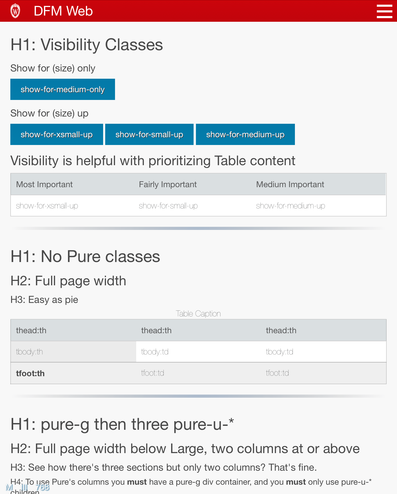

# DfmWeb

[](https://travis-ci.com/DFMCH/dfm_web)


## Install

Gemfile
```ruby
gem 'dfm_web'
```

```bash
bundle install
```

application.css
```
 *= require dfm_web/dfm_web
```

application.coffee (Turbolinks)
```
#= require dfm_web/dfm_web

$(document).on 'turbolinks:load', ->
  DfmWeb.activate_dfm_web();
```

application.coffee (Vanilla)
```
#= require dfm_web/dfm_web

$(document).on 'ready page:load', ->
  DfmWeb.activate_dfm_web();
```


application.html.erb
```
  <body>
    <%= render 'layouts/nav' %>
    <%= render 'layouts/flash' %>
    <%= render 'layouts/main' %>
    <%= render 'layouts/footer' %>
  </body>
```

config/initializers/assets.rb
```
Rails.application.config.assets.precompile += %w( dfm_web/* )
```
### Notes on Version 4:
* Now using the UW look and feel.
* UW font (verlag) cannot be added to the repo per licensing requirements.
  - To use it in your site add verlag.css to your host app (provided by UW).
  - It will be used if available with fallback to Helvetica etc.
* Navbar img is no longer vertically centered in CSS.
  - Pad your PNG/SVG with transparency.
  - Image be scaled to 42px, but PNG should be at least double that.


### Notes on Version 3+:
* Javascript to do things other than run the the actual layout has been removed. Specifically:
  - ajax_load
  - auto_submit
  - autofocus
  - datepicker
  - live_search
  - live_table
  - tablesorter
* If you used these features you'll need to pull the javascript from [version 2](https://github.com/DFMCH/dfm_web/blob/518833db5cbbc9aabcfd7ea60dc9960ae67d3406/app/assets/javascripts/dfm_web/dfm_web.js.coffee)


### Things to remove from your app:
* `scaffold.css`
* `<p id="notice"><%= notice %></p>` Anywhere in your app.

## Kitchen Sink:
* To see the Kitchen Sink, go to spec/dummy and run `rails server`

#### Large Screen:


#### iPad and Smaller:


#### Mobile:

