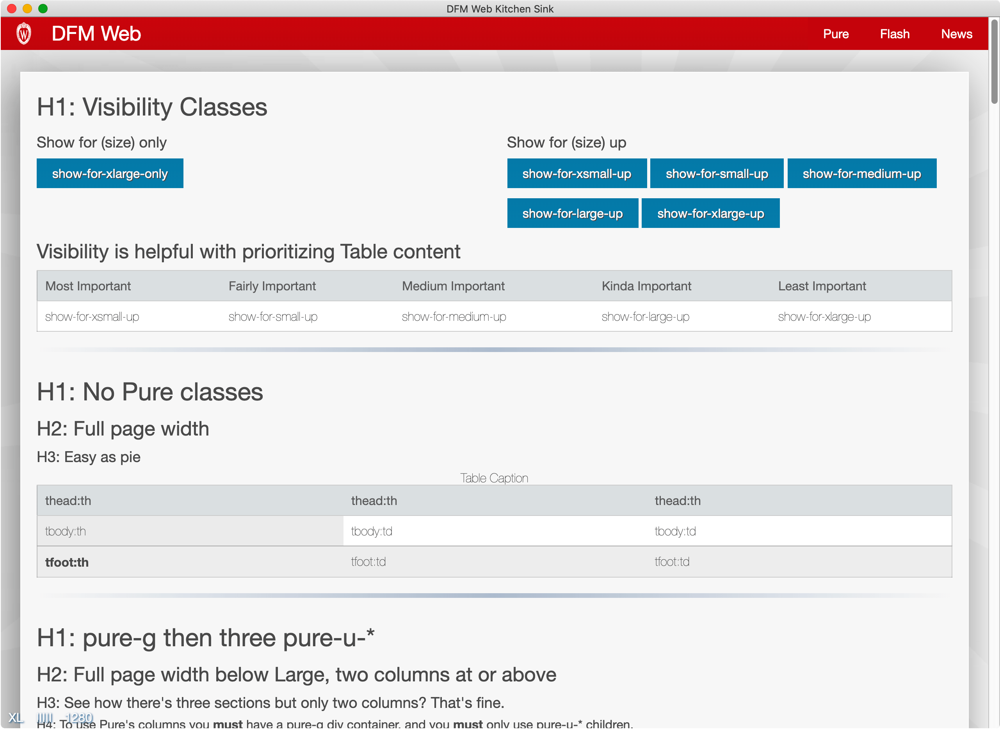

# DfmWeb

[](https://travis-ci.com/DFMCH/dfm_web)


## Install

Gemfile
```ruby
gem 'dfm_web'
```

```bash
bundle install
```

application.css
```
 *= require dfm_web/dfm_web
```

application.coffee (Turbolinks)
```
#= require dfm_web/dfm_web

$(document).on 'turbolinks:load', ->
  DfmWeb.activate_dfm_web();
```

application.coffee (Vanilla)
```
#= require dfm_web/dfm_web

$(document).on 'ready page:load', ->
  DfmWeb.activate_dfm_web();
```


application.html.erb
```
  <body>
    <%= render 'layouts/nav' %>
    <%= render 'layouts/flash' %>
    <%= render 'layouts/main' %>
    <%= render 'layouts/footer' %>
  </body>
```

config/initializers/assets.rb
```
Rails.application.config.assets.precompile += %w( dfm_web/* )
```

### Notes on Version 3:
* Javascript to do things other than run the the actual layout has been removed. Specifically:
  - ajax_load
  - auto_submit
  - autofocus
  - datepicker
  - live_search
  - live_table
  - tablesorter
* If you used these features you'll need to pull the javascript from [version 2](https://github.com/DFMCH/dfm_web/blob/518833db5cbbc9aabcfd7ea60dc9960ae67d3406/app/assets/javascripts/dfm_web/dfm_web.js.coffee)

### Things to remove from your app:
* `scaffold.css`
* `<p id="notice"><%= notice %></p>` Anywhere in your app.

## Kitchen Sink:
* To see the Kitchen Sink, go to spec/dummy and run `rails server`

### Notes on Sprocket 4.0
If you're having trouble running the spec/dummy under sprocket 4.0, that means you'll need to force your sprocket version to stay below 4.0 or include a `manifest.js` file inside `spec/dummy/app/assets/config/`.  Here's a example of how it should look like in manifest.js file:
```
//= link_tree ../images
//= link_directory ../javascripts .js
//= link_directory ../stylesheets .css
//= link dfm_web/apple-touch-icon.png
//= link dfm_web/uwcrest.png
```

We have to include the apple-touch-icon and uwcrest seperately here to load them correctly for the dummy.  More info can be found on this [issue here](https://github.com/rails/sprockets-rails/issues/444).

#### Large Screen:


#### iPad and Smaller:


#### Mobile:

